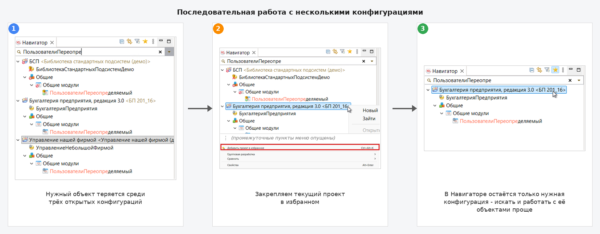
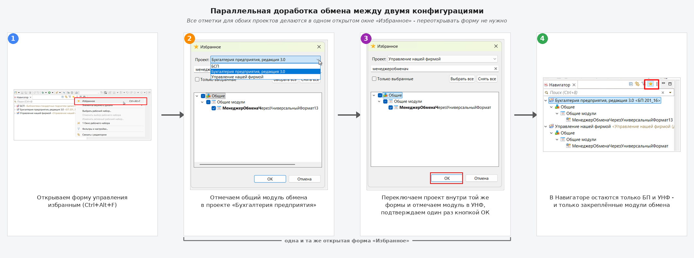

# EDT Metadata Favorites

[](https://github.com/leobrn/edt-metadata-favorites/releases/latest)
[](https://openyellow.org/grid?filter=top&repo=1309735905)

Плагин для 1С:EDT, который добавляет избранное для проектов и объектов метаданных в Навигаторе.

**Последовательная работа с несколькими конфигурациями.** Избранное сужает Навигатор до одной нужной
конфигурации - остальные скрываются, пока вы не переключитесь на следующую задачу.



**Параллельная доработка нескольких конфигураций.** В одном окне формы управления избранным
закрепляете нужные объекты сразу в двух проектах - Навигатор показывает только их. На картинке
это модули обмена между БП и УНФ, но так же работает любая другая связка конфигураций.



И это ещё не всё...

## Возможности

- [добавление в избранное](docs/user-guide.md#как-добавлять-и-удалять-из-избранного) проектов,
  отдельных объектов метаданных и объектов
  прямо из открытого редактора;
- [рекурсивное добавление веток](docs/user-guide.md#на-объекте-метаданных) с автоматическим
  включением новых дочерних объектов;
- [массовое управление избранным](docs/user-guide.md#форма-управления-избранным) с поиском и
  групповой отметкой;
- режим [«Только избранное»](docs/user-guide.md#фильтр-только-избранное) в Навигаторе;
- визуальная отметка избранных элементов;
- автоматическая очистка ссылок на удалённые объекты;
- [горячие клавиши](docs/user-guide.md#горячие-клавиши) для текущего элемента и диалога управления.

Избранное [хранится в служебной области workspace](docs/user-guide.md#где-хранится-избранное) и не
изменяет проекты конфигураций. Объекты идентифицируются по UUID, поэтому переименование не сбрасывает
их состояние.

## Какую проблему решает

В крупной конфигурации Навигатор быстро превращается в длинное дерево из тысяч объектов. При каждой
смене задачи приходится заново раскрывать нужные ветки, искать связанные документы, регистры и модули,
а при работе с несколькими конфигурациями — ещё и постоянно переключаться между похожими деревьями.
Рабочий контекст теряется среди метаданных, которые прямо сейчас не нужны.

EDT Metadata Favorites позволяет один раз собрать объекты текущей задачи и скрыть остальное. Вместо
полного дерева в Навигаторе остаётся компактный рабочий набор, который можно быстро перестроить при
переходе к следующей задаче.

Например:

- **[Несколько конфигураций в одном workspace](docs/user-guide.md#последовательная-работа-с-несколькими-конфигурациями).**
  Закрепите текущий проект целиком, скройте остальные, а после завершения задачи переключите
  избранное на следующую конфигурацию.
- **[Параллельная доработка нескольких конфигураций](docs/user-guide.md#параллельная-доработка-нескольких-конфигураций).**
  Закрепите связанные объекты отдельно в каждой из конфигураций - например, общие модули обмена
  в БП и УНФ, - чтобы видеть обе стороны в одном компактном дереве и быстро переходить между ними.
- **[Локальная задача в большой конфигурации](docs/user-guide.md#доработка-нескольких-связанных-объектов-в-большой-конфигурации).**
  Оставьте в Навигаторе только нужные документы, регистры, модули и их вложенные объекты вместо
  постоянного поиска по полному дереву метаданных.

Больше примеров и пошаговые варианты работы собраны в разделе
[«Сценарии использования»](docs/user-guide.md#сценарии-использования) руководства пользователя.

## Документация

- [Руководство пользователя](docs/user-guide.md)
- [Руководство разработчика](docs/developer-guide.md)
- [История изменений](docs/CHANGELOG.md)
- [Участие в разработке](docs/CONTRIBUTING.md)
- [Чек-лист ручного тестирования](docs/manual-testing-checklist.md)


## Требования

- 1С:EDT 2026.1;
- Java 17 для запуска плагина;
- JDK 21 или новее и Maven 3.9.9 или новее для сборки.

## Установка

После release-сборки добавьте полученный update-site ZIP в 1С:EDT:

1. Откройте `Help → Install New Software`.
2. Добавьте архив
   `.build/releases/<version>/edt-metadata-favorites-update-site-<version>.zip`.
3. Выберите `EDT Metadata Favorites` и завершите установку.
4. Перезапустите 1С:EDT.

## Сборка release

```powershell
.\build-release.ps1
```

Скрипт выполняет `mvn clean verify`, запускает автоматические тесты и формирует в
`.build/releases/<version>/` комплект для GitHub Releases:

- update-site ZIP для установки через 1С:EDT;
- bundle JAR для установки через `dropins`;
- `release-notes.md` из секции `Unreleased` changelog;
- `SHA256SUMS.txt`.

Каталоги `target/` содержат только промежуточные результаты Maven. Версия release определяется из
`app/pom.xml`; перед публичным выпуском она не должна содержать `-SNAPSHOT`.

## Структура

```text
app/
  bundles/       исходный код и ресурсы плагина
  features/      installable feature
  repositories/ p2 update site
  targets/       target platform для 1С:EDT
tests/           автоматические тесты
docs/            пользовательская и проектная документация
```

## Лицензия

Проект распространяется по лицензии [MIT](LICENSE).
