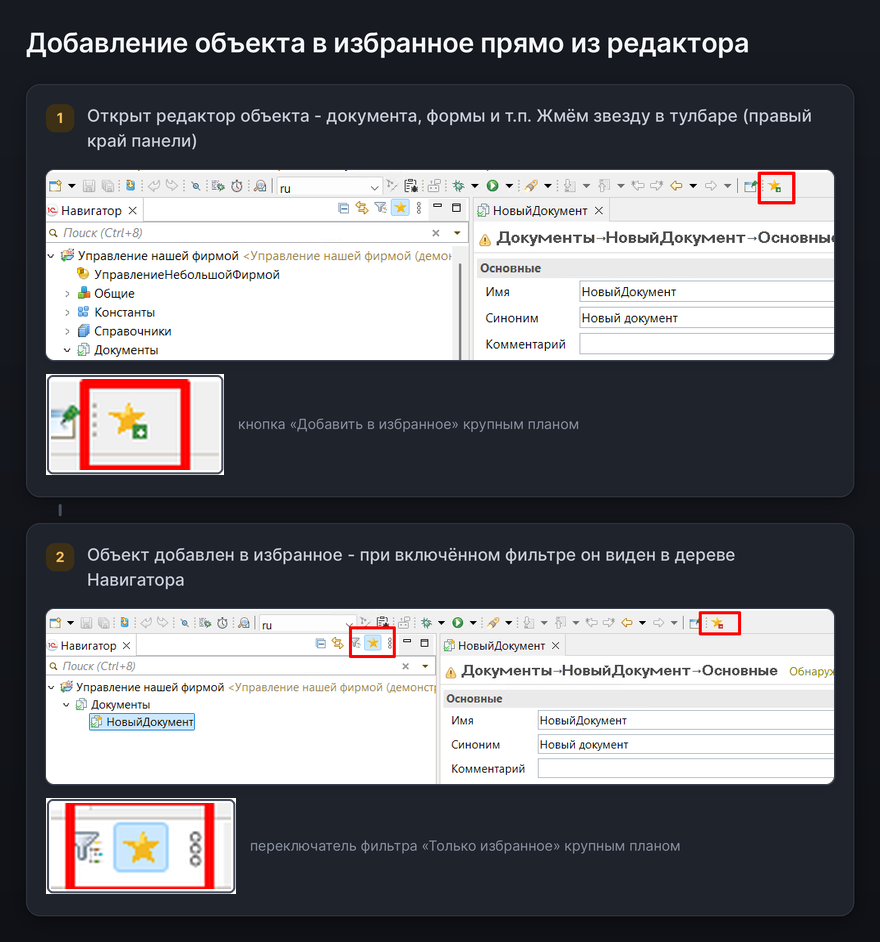
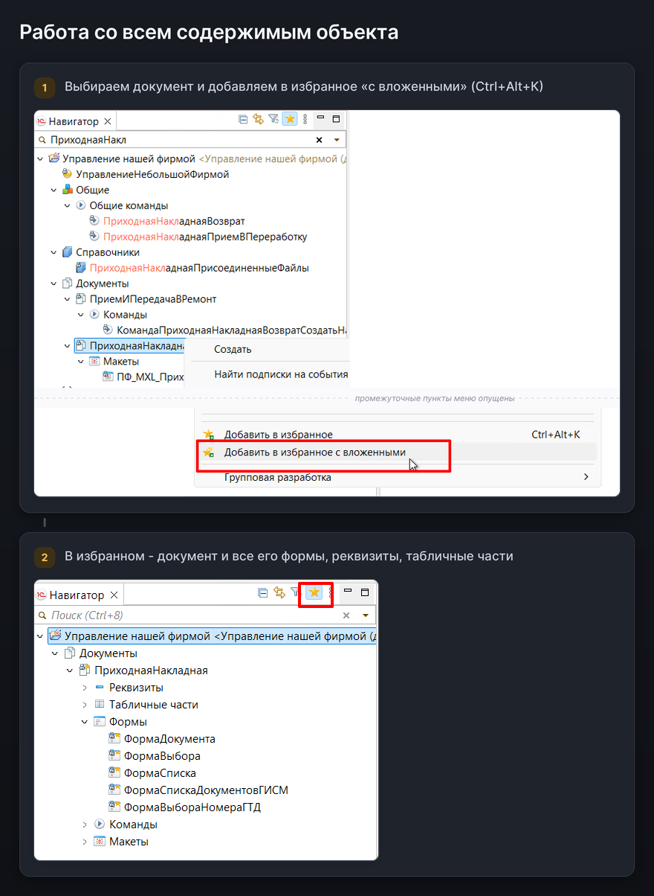

# Избранное метаданных — руководство пользователя

Плагин помогает оставить в Навигаторе 1С:EDT только проекты и объекты метаданных, которые нужны
для текущей задачи.

## Быстрый старт

1. В Навигаторе щёлкните проект или объект правой кнопкой мыши.
2. Выберите **Добавить проект в избранное** или **Добавить в избранное**.
3. Включите кнопку-звезду **Только избранное** на панели Навигатора.

Чтобы вернуть элемент в обычное состояние, выберите его и выполните **Удалить из избранного**.

## Как добавлять и удалять из избранного

Команды плагина находятся в контекстном меню Навигатора. В меню показываются только действия,
которые применимы к выбранному элементу.

- Для проекта доступны команды добавления и удаления проекта, а также удаления всех избранных
  объектов внутри него.
- Для отдельного объекта доступны команды добавления и удаления объекта.
- Для объекта, открытого в редакторе, то же действие выполняет кнопка-звезда на главной панели EDT.

### На объекте метаданных

Команда **Добавить в избранное с вложенными** добавляет всю ветку: например, документ вместе
с формами, реквизитами и табличными частями. Новые элементы в этой ветке также будут добавляться
автоматически.

Обычная команда **Добавить в избранное** действует только на выбранный объект. Отдельного потомка
рекурсивно добавленной ветки можно удалить из избранного — он сохранится как исключение.

## Форма управления избранным

Для массового выбора нажмите **Ctrl+Alt+F** или откройте команду **Избранное** в дополнительном
меню Навигатора.

В форме можно:

- переключаться между открытыми проектами;
- искать объекты по имени или техническому пути, например `Catalog.Контрагенты`;
- выбирать отдельные объекты или целые группы;
- показывать только выбранные объекты;
- выбрать или снять все показанные объекты.

Поиск начинается с третьего символа. Для поиска вложенных объектов можно указать путь, например
`Catalog.Контрагенты.Form`.

Изменения сохраняются кнопкой **ОК**. После сохранения фильтр **Только избранное** включается
автоматически.

## Фильтр «Только избранное»

Кнопка-звезда на панели Навигатора переключает полное и сокращённое дерево.

- Избранный проект без отдельно выбранных объектов показывается целиком.
- Если внутри проекта есть избранные объекты, показываются только они и путь к ним.
- Проект, который не добавлен в избранное, показывается только при наличии избранных объектов
  внутри него.

Чтобы снова видеть избранный проект целиком, удалите все избранные объекты внутри него командой
в контекстном меню проекта.

### Примеры

Если добавить в избранное один проект без отдельных объектов, фильтр скроет остальные проекты,
но оставит выбранную конфигурацию целиком.

Если добавить отдельные объекты в нескольких проектах, фильтр соберёт их в одном компактном дереве.

## Горячие клавиши

- **Ctrl+Alt+K** — добавить или удалить текущий элемент.
- **Ctrl+Alt+F** — открыть форму управления избранным.

Комбинации можно изменить в **Window → Preferences → General → Keys** (категория **Избранное**).

## Где хранится избранное

Избранное хранится в рабочем пространстве EDT и не изменяет конфигурацию или файлы проекта.
Настройки не попадают в git и остаются личными для каждого рабочего пространства. Переименование
объекта не сбрасывает отметку.

Если звёзды не видны, включите декоратор избранного в
**Window → Preferences → General → Appearance → Label Decorations**.

## Частые вопросы

**Не вижу команды плагина в контекстном меню.** Команды доступны только в панели
**Навигатор** 1С:EDT.

**Не работает горячая клавиша.** Проверьте, не назначена ли эта комбинация другой команде:
**Window → Preferences → General → Keys**.

**После добавления объекта проект стал показываться не целиком.** Это ожидаемо: если внутри проекта
есть избранные объекты, фильтр показывает только их и пути к ним. Чтобы снова видеть весь проект,
удалите все избранные объекты внутри него.
